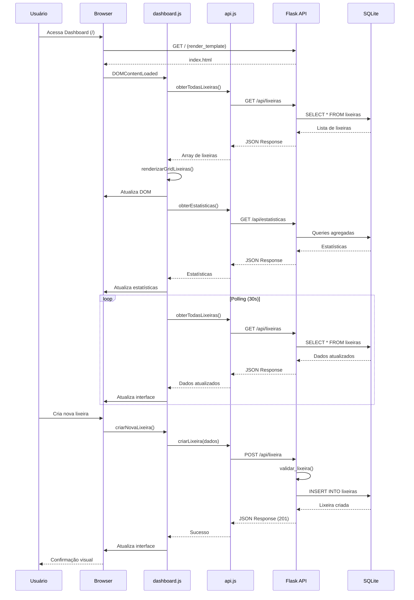
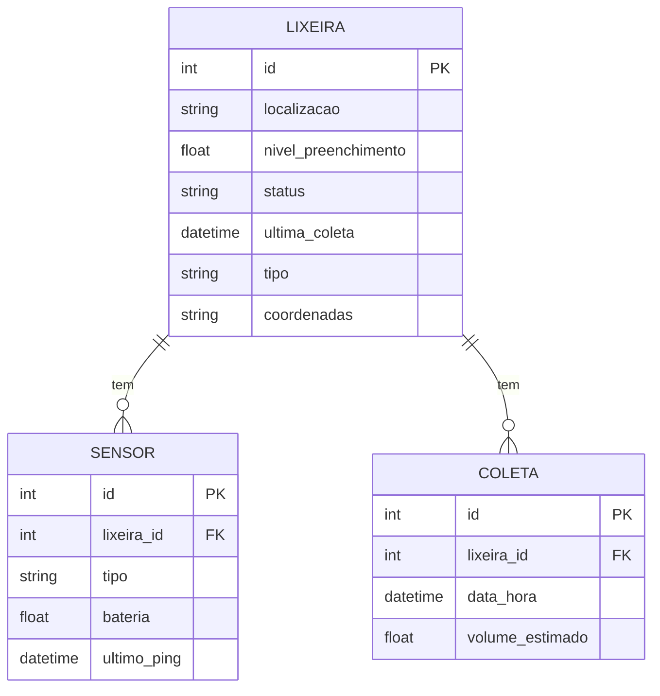
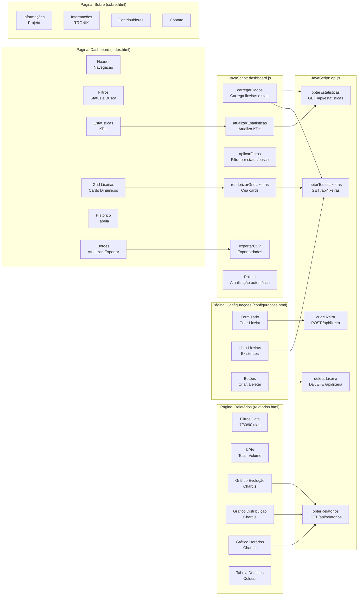
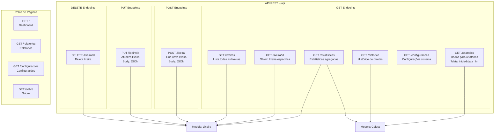
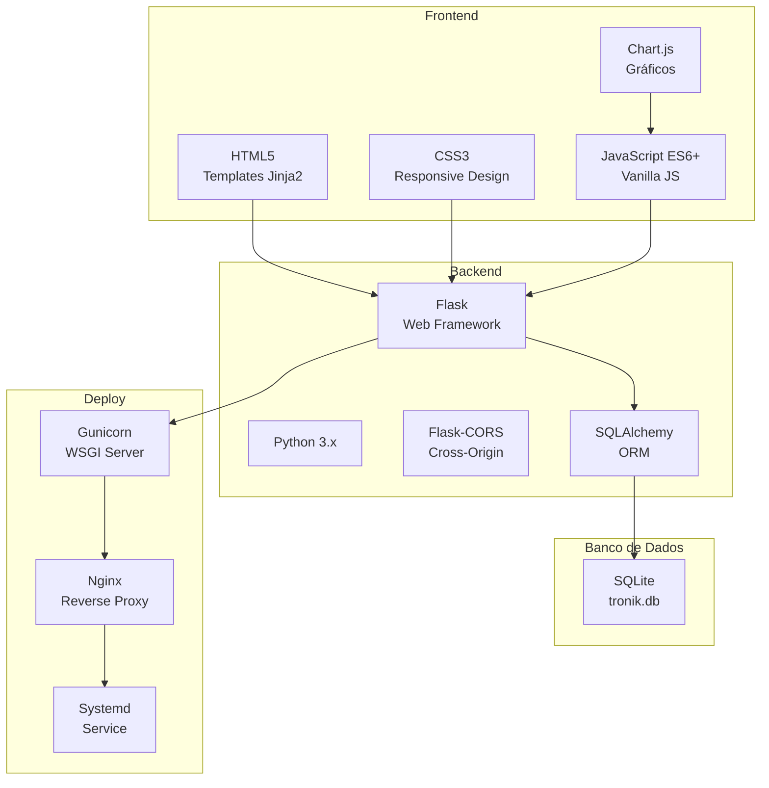

# Arquitetura do Dashboard-TRONIK

## Diagrama de Arquitetura Completa

```mermaid
graph TB
    subgraph "Cliente - Navegador"
        Browser[Browser]
        subgraph "Frontend - Templates HTML"
            Index[index.html<br/>Dashboard Principal]
            Relatorios[relatorios.html<br/>Relatórios e Gráficos]
            Config[configuracoes.html<br/>CRUD Lixeiras]
            Sobre[sobre.html<br/>Informações do Projeto]
            Base[base.html<br/>Template Base]
        end
        
        subgraph "Frontend - JavaScript"
            DashboardJS[dashboard.js<br/>Lógica Principal<br/>- Carregar dados<br/>- Renderizar grid<br/>- Filtros<br/>- Exportar CSV<br/>- Polling automático]
            APIJS[api.js<br/>Comunicação API<br/>- GET/POST/PUT/DELETE<br/>- Requisições HTTP<br/>- Tratamento de erros]
        end
        
        subgraph "Frontend - CSS"
            EstiloCSS[estilo.css<br/>Estilos Globais]
            RelatoriosCSS[relatorios.css<br/>Estilos Relatórios]
            ConfigCSS[configuracoes.css<br/>Estilos Configurações]
            SobreCSS[sobre.css<br/>Estilos Sobre]
        end
    end
    
    subgraph "Backend - Flask Application"
        App[app.py<br/>Aplicação Principal<br/>- Inicialização Flask<br/>- Configuração CORS<br/>- Setup Banco de Dados<br/>- Registro de Blueprints]
        
        subgraph "Blueprints"
            APIBP[api.py<br/>Blueprint API<br/>Endpoints REST]
            PaginasBP[paginas.py<br/>Blueprint Páginas<br/>Rotas HTML]
        end
        
        subgraph "Endpoints API"
            GET1[GET /api/lixeiras<br/>Listar todas]
            GET2[GET /api/lixeira/id<br/>Obter uma]
            GET3[GET /api/estatisticas<br/>Estatísticas gerais]
            GET4[GET /api/historico<br/>Histórico coletas]
            GET5[GET /api/configuracoes<br/>Configurações sistema]
            GET6[GET /api/relatorios<br/>Dados para relatórios]
            POST1[POST /api/lixeira<br/>Criar nova]
            PUT1[PUT /api/lixeira/id<br/>Atualizar]
            DELETE1[DELETE /api/lixeira/id<br/>Deletar]
        end
        
        subgraph "Rotas Páginas"
            R1[GET /<br/>Dashboard]
            R2[GET /relatorios<br/>Relatórios]
            R3[GET /configuracoes<br/>Configurações]
            R4[GET /sobre<br/>Sobre]
        end
    end
    
    subgraph "Banco de Dados"
        subgraph "Modelos SQLAlchemy"
            ModelLixeira[Lixeira<br/>- id<br/>- localizacao<br/>- nivel_preenchimento<br/>- status<br/>- ultima_coleta<br/>- tipo<br/>- coordenadas]
            ModelSensor[Sensor<br/>- id<br/>- lixeira_id<br/>- tipo<br/>- bateria<br/>- ultimo_ping]
            ModelColeta[Coleta<br/>- id<br/>- lixeira_id<br/>- data_hora<br/>- volume_estimado]
        end
        
        SQLite[(SQLite<br/>tronik.db)]
        
        subgraph "Inicialização"
            Inicializar[inicializar.py<br/>- criar_banco<br/>- inserir_dados_iniciais<br/>- resetar_banco]
            MockData[sensores_mock.json<br/>Dados Mock<br/>- Lixeiras<br/>- Histórico Coletas]
        end
    end
    
    subgraph "Deploy e Configuração"
        Gunicorn[gunicorn.conf.py<br/>Configuração WSGI]
        Nginx[nginx/tronik.conf<br/>Configuração Nginx]
        Service[dashboard-tronik.service<br/>Systemd Service]
    end
    
    Browser --> Index
    Browser --> Relatorios
    Browser --> Config
    Browser --> Sobre
    Browser --> Base
    
    Index --> DashboardJS
    Relatorios --> DashboardJS
    Config --> DashboardJS
    Sobre --> DashboardJS
    
    Index --> EstiloCSS
    Relatorios --> RelatoriosCSS
    Config --> ConfigCSS
    Sobre --> SobreCSS
    Base --> EstiloCSS
    
    DashboardJS --> APIJS
    APIJS --> APIBP
    
    App --> APIBP
    App --> PaginasBP
    
    APIBP --> GET1
    APIBP --> GET2
    APIBP --> GET3
    APIBP --> GET4
    APIBP --> GET5
    APIBP --> GET6
    APIBP --> POST1
    APIBP --> PUT1
    APIBP --> DELETE1
    
    PaginasBP --> R1
    PaginasBP --> R2
    PaginasBP --> R3
    PaginasBP --> R4
    
    GET1 --> ModelLixeira
    GET2 --> ModelLixeira
    GET3 --> ModelLixeira
    GET3 --> ModelColeta
    GET4 --> ModelColeta
    GET6 --> ModelColeta
    POST1 --> ModelLixeira
    PUT1 --> ModelLixeira
    DELETE1 --> ModelLixeira
    
    ModelLixeira --> SQLite
    ModelSensor --> SQLite
    ModelColeta --> SQLite
    
    ModelLixeira -.->|1:N| ModelSensor
    ModelLixeira -.->|1:N| ModelColeta
    
    Inicializar --> SQLite
    MockData --> Inicializar
    
    App --> Inicializar
    
    Gunicorn --> App
    Nginx --> Gunicorn
    Service --> Gunicorn
    
    style App fill:#4a90e2,stroke:#2c5aa0,stroke-width:3px,color:#fff
    style SQLite fill:#3d9970,stroke:#2d6e4e,stroke-width:3px,color:#fff
    style Browser fill:#f39c12,stroke:#d68910,stroke-width:2px,color:#fff
    style DashboardJS fill:#e74c3c,stroke:#c0392b,stroke-width:2px,color:#fff
    style APIJS fill:#e74c3c,stroke:#c0392b,stroke-width:2px,color:#fff
```

## Diagrama de Fluxo de Dados

## Diagrama de Estrutura de Diretórios

```mermaid
graph TD
    Root[Dashboard-TRONIK/]
    
    Root --> App[app.py]
    Root --> Req[requirements.txt]
    Root --> DB[tronik.db]
    
    Root --> Banco[banco_dados/]
    Banco --> Modelos[modelos.py<br/>Lixeira, Sensor, Coleta]
    Banco --> Init[inicializar.py<br/>Setup DB]
    Banco --> Dados[dados/]
    Dados --> Mock[sensores_mock.json]
    
    Root --> Rotas[rotas/]
    Rotas --> API[api.py<br/>Endpoints REST]
    Rotas --> Paginas[paginas.py<br/>Rotas HTML]
    
    Root --> Templates[templates/]
    Templates --> Base[base.html]
    Templates --> Index[index.html]
    Templates --> Rel[relatorios.html]
    Templates --> Config[configuracoes.html]
    Templates --> Sobre[sobre.html]
    
    Root --> Estatico[estatico/]
    Estatico --> CSS[css/]
    CSS --> Estilo[estilo.css]
    CSS --> RelCSS[relatorios.css]
    CSS --> ConfigCSS[configuracoes.css]
    CSS --> SobreCSS[sobre.css]
    
    Estatico --> JS[js/]
    JS --> DashboardJS[dashboard.js]
    JS --> APIJS[api.js]
    
    Estatico --> Imagens[imagens/]
    
    Root --> Docs[docs/]
    Docs --> MVP[MVP.md]
    Docs --> Planejamento[Planejamento.md]
    Docs --> Espec[Especificacao_Tecnica.md]
    
    Root --> Deploy[deploy/]
    Deploy --> Gunicorn[gunicorn.conf.py]
    Deploy --> Nginx[nginx/]
    Deploy --> Service[dashboard-tronik.service]
    
    Root --> Teste[teste/]
    Teste --> Mockups[Mockups HTML]
```

## Diagrama de Modelo de Dados

## Diagrama de Componentes Frontend

## Diagrama de Endpoints da API

## Stack Tecnológico

