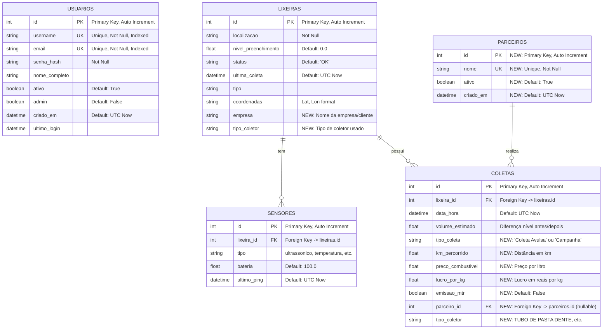

# 📊 Modelo de Banco de Dados - Dashboard-TRONIK

## Diagrama ER (Entity-Relationship)



---

## 📋 Descrição das Tabelas

### 1. **USUARIOS** (Existente)
Tabela de usuários do sistema com autenticação.

**Campos:**
- `id` - Chave primária
- `username` - Nome de usuário único
- `email` - Email único
- `senha_hash` - Hash da senha (Werkzeug)
- `nome_completo` - Nome completo do usuário
- `ativo` - Se o usuário está ativo
- `admin` - Se é administrador
- `criado_em` - Data de criação
- `ultimo_login` - Último login

---

### 2. **LIXEIRAS** (Expandida)
Tabela de lixeiras inteligentes. **Adicionados 2 novos campos.**

**Campos Existentes:**
- `id` - Chave primária
- `localizacao` - Localização da lixeira
- `nivel_preenchimento` - Nível atual (0-100%)
- `status` - Status (OK, alerta, manutencao)
- `ultima_coleta` - Data da última coleta
- `tipo` - Tipo de lixeira
- `coordenadas` - Coordenadas geográficas

**Campos Novos:**
- `empresa` - Nome da empresa/cliente (do CSV)
- `tipo_coletor` - Tipo de coletor usado (TUBO DE PASTA DENTE, etc.)

**Relacionamentos:**
- 1:N com `SENSORES`
- 1:N com `COLETAS`

---

### 3. **SENSORES** (Sem mudanças)
Tabela de sensores associados às lixeiras.

**Campos:**
- `id` - Chave primária
- `lixeira_id` - Chave estrangeira para `lixeiras`
- `tipo` - Tipo de sensor
- `bateria` - Nível de bateria (0-100%)
- `ultimo_ping` - Último ping do sensor

**Relacionamentos:**
- N:1 com `LIXEIRAS`

---

### 4. **COLETAS** (Expandida)
Tabela de histórico de coletas. **Adicionados 7 novos campos.**

**Campos Existentes:**
- `id` - Chave primária
- `lixeira_id` - Chave estrangeira para `lixeiras`
- `data_hora` - Data e hora da coleta
- `volume_estimado` - Volume estimado coletado

**Campos Novos:**
- `tipo_coleta` - "Coleta Avulsa" ou "Campanha"
- `km_percorrido` - Distância percorrida em km
- `preco_combustivel` - Preço do combustível por litro
- `lucro_por_kg` - Lucro em reais por quilograma
- `emissao_mtr` - Se houve emissão de MTR (boolean)
- `parceiro_id` - Chave estrangeira para `parceiros` (nullable)
- `tipo_coletor` - Tipo de coletor usado na coleta

**Relacionamentos:**
- N:1 com `LIXEIRAS`
- N:1 com `PARCEIROS` (opcional)

---

### 5. **PARCEIROS** (Nova Tabela)
Tabela de parceiros da Tronik. **Nova tabela criada.**

**Campos:**
- `id` - Chave primária
- `nome` - Nome do parceiro (único)
- `ativo` - Se o parceiro está ativo
- `criado_em` - Data de criação

**Relacionamentos:**
- 1:N com `COLETAS`

**Parceiros Identificados:**
- INSTITUTO ARAPOTI
- ECOGRANA
- NEOENERGIA
- ESG SUMMIT
- COLEGIO RENOVAÇÃO
- COLETA SEM PARCEIRO (especial)

---

## 🔄 Relacionamentos

```
LIXEIRAS (1) ──< (N) SENSORES
    │
    │
    └──< (N) COLETAS ──> (N) PARCEIROS
```

**Cardinalidades:**
- Uma `LIXEIRA` pode ter vários `SENSORES` (1:N)
- Uma `LIXEIRA` pode ter várias `COLETAS` (1:N)
- Um `PARCEIRO` pode ter várias `COLETAS` (1:N)
- Uma `COLETA` pertence a uma `LIXEIRA` (N:1)
- Uma `COLETA` pode ter um `PARCEIRO` (N:1, opcional)

---

## 📊 Resumo de Mudanças

### Campos Adicionados
- **LIXEIRAS:** +2 campos (`empresa`, `tipo_coletor`)
- **COLETAS:** +7 campos (`tipo_coleta`, `km_percorrido`, `preco_combustivel`, `lucro_por_kg`, `emissao_mtr`, `parceiro_id`, `tipo_coletor`)

### Tabelas Criadas
- **PARCEIROS:** Nova tabela com 4 campos

### Total
- **5 tabelas** no banco de dados
- **9 novos campos** adicionados
- **1 nova tabela** criada

---

## 🔑 Índices e Constraints

### Índices Existentes
- `usuarios.username` - Índice único
- `usuarios.email` - Índice único

### Índices Recomendados (Novos)
- `coletas.parceiro_id` - Para buscas por parceiro
- `coletas.data_hora` - Para buscas por período
- `coletas.tipo_coleta` - Para filtros
- `lixeiras.empresa` - Para buscas por empresa

### Foreign Keys
- `sensores.lixeira_id` → `lixeiras.id`
- `coletas.lixeira_id` → `lixeiras.id`
- `coletas.parceiro_id` → `parceiros.id` (nullable)

---

## 📝 Notas de Implementação

1. **Compatibilidade:** Campos novos são nullable para não quebrar dados existentes
2. **Migração:** Usar Flask-Migrate/Alembic para migração controlada
3. **Dados Existentes:** `volume_estimado` mantido para compatibilidade, mas `quantidade_kg` pode ser adicionado depois
4. **Parceiro NULL:** Coletas sem parceiro terão `parceiro_id = NULL`

---

**Data de Criação:** 2025-01-27  
**Versão:** 2.0 (Expandida para integração CSV)

