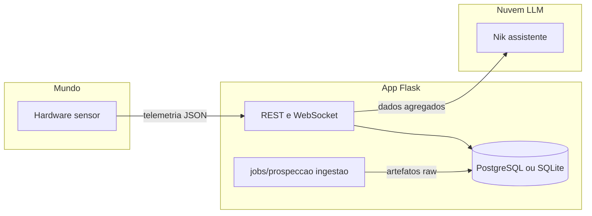
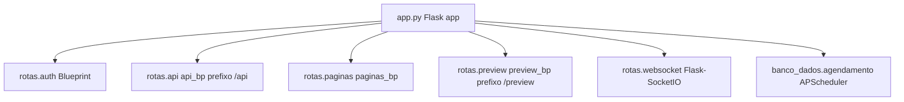
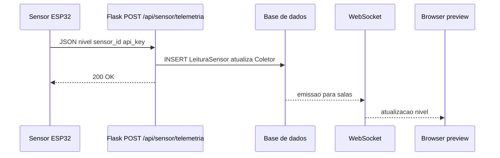
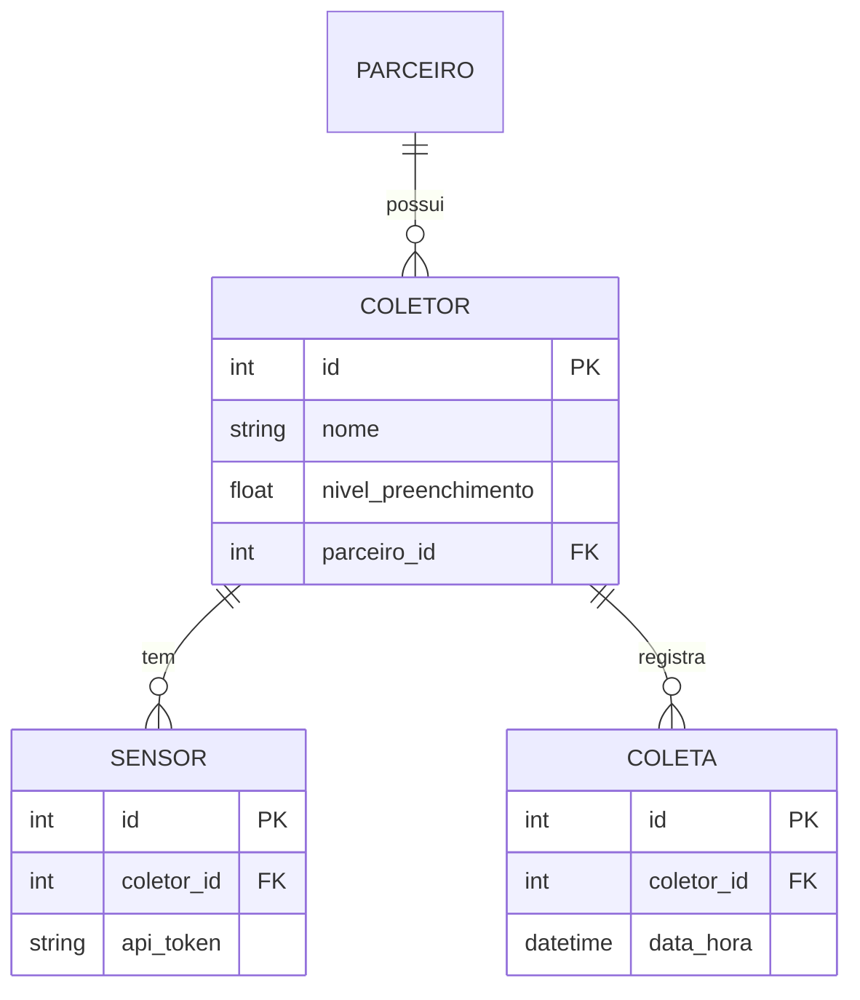
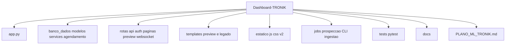
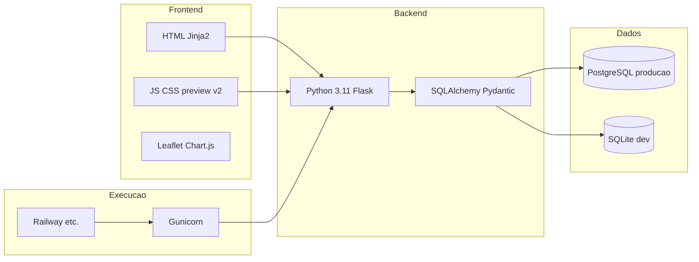

# Arquitetura do Dashboard-TRONIK

Documento alinhado ao repositório atual (preview v2, API modular, telemetria, ML parcial, jobs de ingestão). Diagramas em Mermaid (GitHub / VS Code / MkDocs).

**Relacionados:** [DIAGRAMAS.md](DIAGRAMAS.md) (índice + **SVG/PNG**) · [PLANO_ML_TRONIK.md](../PLANO_ML_TRONIK.md) · [jobs/prospeccao/README.md](../jobs/prospeccao/README.md) · [ESTADO_ATUAL_PROJETO.md](ESTADO_ATUAL_PROJETO.md)

---

## Visão em três camadas

| Camada | Papel | Tecnologia |
|--------|--------|------------|
| **Mundo / físico** | Medição de nível, bateria, identidade do sensor | ESP32 + firmware → `POST /api/sensor/telemetria` |
| **Aplicação e ML tabular** | Persistência, regras de negócio, ranking de coletores, predição, jobs batch | Flask, SQLAlchemy, APScheduler, `jobs/prospeccao/` |
| **Linguagem / explicação** | Assistente operacional sobre dados já curados | Nik (LLM), tools sobre API e contexto |



---

## Componentes principais (backend)



- **`/api`**: coletores, coletas, sensores, comercial, CRM, contratos, prospecção (`/api/prospeccao/*`), ML (`/api/ml/...`), Nik (`/api/nik/*`), telemetria autenticada.
- **`/preview`**: UI v2 (hub, monitoramento, mapa, relatórios, prospecção, Nik, gestão, CRM/comercial/contratos no shell v2) — `auth_preview` / `admin_preview` conforme rota.
- **`/auth`**: login, logout, registo.
- **WebSocket**: atualização em tempo quase real no preview (ex.: níveis).

---

## Fluxo de telemetria (resumo)



---

## Fluxo de dados ML (estado atual)

Ver diagrama detalhado: [13-ml-coletores-legado.mmd](diagramas/13-ml-coletores-legado.mmd) e [04-prospeccao-pipeline-v33.mmd](diagramas/04-prospeccao-pipeline-v33.mmd).

```mermaid
flowchart TB
  subgraph sched["APScheduler"]
    M1[ml_predicao 12h]
    M2[ml_score 24h]
    M3[ml_narrativa]
    M4[pipeline prospeccao opcional]
  end
  subgraph ml_ops["ML coletores"]
    P1[ml_predicao]
    P2[ml_score]
    P3[ml_narrativa]
  end
  subgraph ml_ree["Prospecção REE v3.3"]
    JOB[jobs/prospeccao]
    XGB[XGBRanker]
    DB[(score_prospeccao)]
  end
  API_ML[/api/ml] --> P1
  API_ML --> P2
  API_PROSP[/api/prospeccao] --> DB
  M4 --> JOB --> XGB --> DB
  M1 --> P1
  M2 --> P2
  M3 --> P3
```

A **prospecção geográfica antiga** (heatmap, `locais_prospeccao`, `/api/ml/prospeccao`) foi **removida**. O eixo REE atual: ingestão batch → rank listwise → fila em `/preview/prospeccao`, API `/api/prospeccao/*` e ferramentas Nik.

---

## Modelo de dados (núcleo operação)

Nomes orientativos; detalhe em `banco_dados/modelos.py`.



---

## Estrutura de pastas (alto nível)



---

## Stack e deploy



---

## Notas de manutenção

1. **Mermaid:** evitar caracteres especiais nos IDs dos nós; `subgraph` com rótulos entre aspas quando tiver espaços.
2. **Rotas exatas** mudam com o tempo; para lista completa use o código em `rotas/api/` e `app.py`.
3. **Diagramas antigos** (dashboard monolítico em `templates/index.html` na raiz, “Lixeira” como entidade principal) foram substituídos por esta versão.

Última revisão da arquitetura documentada: maio/2026.
