# Diagramas do sistema — Dashboard-TRONIK

Índice com **imagens exportadas** (SVG + PNG) e fontes Mermaid editáveis. Todos os diagramas produzidos no desenvolvimento do projeto (arquitetura, prospecção REE, Nik agentic, CRM, fases 0–4).

**Relacionados:** [ARQUITETURA.md](ARQUITETURA.md) · [PLANO_ML_TRONIK.md](../PLANO_ML_TRONIK.md) · [nik_bot/spec_nik_agent.md](../nik_bot/spec_nik_agent.md)

**Última consolidação:** maio/2026

---

## Imagens prontas (abrir no browser ou IDE)

| Formato | Pasta |
|---------|--------|
| **SVG** (vetor, ideal para docs/figma) | [`docs/diagramas/svg/`](diagramas/svg/) |
| **PNG** (bitmap, ideal para slides/WhatsApp) | [`docs/diagramas/png/`](diagramas/png/) |
| **Fonte** (editar e re-exportar) | [`docs/diagramas/*.mmd`](diagramas/) |

**Regenerar tudo:**

```powershell
.\scripts\render_diagramas.ps1        # só SVG
.\scripts\render_diagramas.ps1 -Png   # SVG + PNG
```

---

## Galeria — visão geral

### 18 — Mapa mental (1 página)


[SVG](diagramas/svg/18-mapa-mental.svg) · [PNG](diagramas/png/18-mapa-mental.png) · [Fonte](diagramas/18-mapa-mental.mmd)

### 01 — Três camadas (mundo → app → Nik)


[SVG](diagramas/svg/01-sistema-tres-camadas.svg) · [PNG](diagramas/png/01-sistema-tres-camadas.png) · [Fonte](diagramas/01-sistema-tres-camadas.mmd)

### 04 — Pipeline prospecção REE v3.3


[SVG](diagramas/svg/04-prospeccao-pipeline-v33.svg) · [PNG](diagramas/png/04-prospeccao-pipeline-v33.png) · [Fonte](diagramas/04-prospeccao-pipeline-v33.mmd)

### 06 — Ciclo operacional Tronik


[SVG](diagramas/svg/06-tronik-ciclo-operacional.svg) · [PNG](diagramas/png/06-tronik-ciclo-operacional.png) · [Fonte](diagramas/06-tronik-ciclo-operacional.mmd)

### 07 — Ponte CRM ↔ prospecção


[SVG](diagramas/svg/07-crm-prospeccao-ponte.svg) · [PNG](diagramas/png/07-crm-prospeccao-ponte.png) · [Fonte](diagramas/07-crm-prospeccao-ponte.mmd)

### 11 — Nik agentic (runtime)


[SVG](diagramas/svg/11-nik-agentic-runtime.svg) · [PNG](diagramas/png/11-nik-agentic-runtime.png) · [Fonte](diagramas/11-nik-agentic-runtime.mmd)

### 16 — Roadmap fases 0–4


[SVG](diagramas/svg/16-roadmap-fases.svg) · [PNG](diagramas/png/16-roadmap-fases.png) · [Fonte](diagramas/16-roadmap-fases.mmd)

---

## Galeria — todos os diagramas

### Sistema e backend

| # | Título | Imagem |
|---|--------|--------|
| 01 | Três camadas |  |
| 02 | Blueprints Flask |  |
| 03 | Telemetria (sequência) | 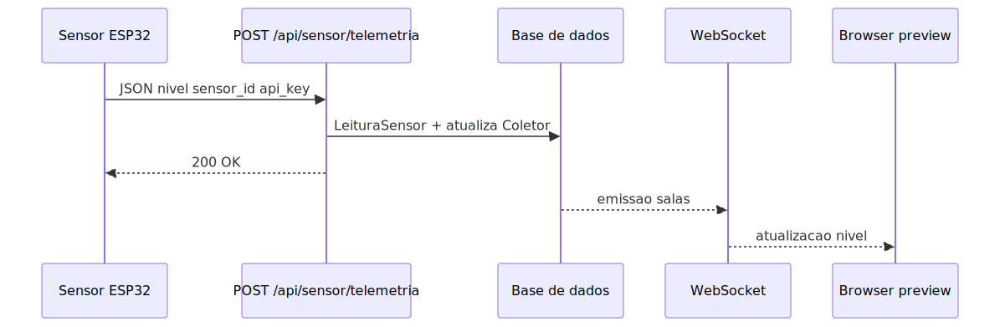 |
| 17 | Stack deploy |  |

Downloads: [01 SVG](diagramas/svg/01-sistema-tres-camadas.svg) · [02](diagramas/svg/02-backend-blueprints.svg) · [03](diagramas/svg/03-telemetria-sequencia.svg) · [17](diagramas/svg/17-deploy-stack.svg)

### Prospecção REE

| # | Título | Imagem |
|---|--------|--------|
| 04 | Pipeline v3.3 |  |
| 05 | Orquestração por camadas |  |
| 09 | Labels internos |  |
| 13 | ML coletores + REE |  |

### Produto, CRM e dados

| # | Título | Imagem |
|---|--------|--------|
| 06 | Ciclo operacional |  |
| 07 | CRM ↔ prospecção |  |
| 08 | Preview v2 shell |  |
| 14 | ER núcleo |  |
| 15 | ER prospecção + CRM |  |

### Nik

| # | Título | Imagem |
|---|--------|--------|
| 10 | Arquitetura Nik |  |
| 11 | Runtime agentic |  |
| 12 | Ferramentas |  |

### Roadmap

| # | Título | Imagem |
|---|--------|--------|
| 16 | Fases 0–4 |  |
| 18 | Mapa mental |  |

---

## Índice com ficheiros fonte (.mmd)

| # | Diagrama | Mermaid | SVG |
|---|----------|---------|-----|
| 01 | Três camadas | [mmd](diagramas/01-sistema-tres-camadas.mmd) | [svg](diagramas/svg/01-sistema-tres-camadas.svg) |
| 02 | Blueprints | [mmd](diagramas/02-backend-blueprints.mmd) | [svg](diagramas/svg/02-backend-blueprints.svg) |
| 03 | Telemetria | [mmd](diagramas/03-telemetria-sequencia.mmd) | [svg](diagramas/svg/03-telemetria-sequencia.svg) |
| 04 | Pipeline REE | [mmd](diagramas/04-prospeccao-pipeline-v33.mmd) | [svg](diagramas/svg/04-prospeccao-pipeline-v33.svg) |
| 05 | Orquestração | [mmd](diagramas/05-prospeccao-orquestracao-fases.mmd) | [svg](diagramas/svg/05-prospeccao-orquestracao-fases.svg) |
| 06 | Ciclo Tronik | [mmd](diagramas/06-tronik-ciclo-operacional.mmd) | [svg](diagramas/svg/06-tronik-ciclo-operacional.svg) |
| 07 | CRM bridge | [mmd](diagramas/07-crm-prospeccao-ponte.mmd) | [svg](diagramas/svg/07-crm-prospeccao-ponte.svg) |
| 08 | Preview v2 | [mmd](diagramas/08-preview-v2-shell.mmd) | [svg](diagramas/svg/08-preview-v2-shell.svg) |
| 09 | Labels internos | [mmd](diagramas/09-labels-internos.mmd) | [svg](diagramas/svg/09-labels-internos.svg) |
| 10 | Nik arquitetura | [mmd](diagramas/10-nik-arquitetura.mmd) | [svg](diagramas/svg/10-nik-arquitetura.svg) |
| 11 | Nik runtime | [mmd](diagramas/11-nik-agentic-runtime.mmd) | [svg](diagramas/svg/11-nik-agentic-runtime.svg) |
| 12 | Nik ferramentas | [mmd](diagramas/12-nik-ferramentas.mmd) | [svg](diagramas/svg/12-nik-ferramentas.svg) |
| 13 | ML + REE | [mmd](diagramas/13-ml-coletores-legado.mmd) | [svg](diagramas/svg/13-ml-coletores-legado.svg) |
| 14 | ER núcleo | [mmd](diagramas/14-modelo-dados-nucleo.mmd) | [svg](diagramas/svg/14-modelo-dados-nucleo.svg) |
| 15 | ER prospecção | [mmd](diagramas/15-modelo-dados-prospeccao-crm.mmd) | [svg](diagramas/svg/15-modelo-dados-prospeccao-crm.svg) |
| 16 | Roadmap | [mmd](diagramas/16-roadmap-fases.mmd) | [svg](diagramas/svg/16-roadmap-fases.svg) |
| 17 | Deploy | [mmd](diagramas/17-deploy-stack.mmd) | [svg](diagramas/svg/17-deploy-stack.svg) |
| 18 | Mapa mental | [mmd](diagramas/18-mapa-mental.mmd) | [svg](diagramas/svg/18-mapa-mental.svg) |

---

## Legado

| Ficheiro | Nota |
|----------|------|
| [`diagrama_arquitetura_dashboard.svg`](../diagrama_arquitetura_dashboard.svg) | Dashboard antigo (pré-preview v2) |
| [`arquitetura.mmd`](../arquitetura.mmd) | Monólito legado |

---

## Manutenção

1. Editar `docs/diagramas/NN-nome.mmd` (não usar `[/rota/...]` em nós — usar `ID["rótulo"]`).
2. Correr `.\scripts\render_diagramas.ps1 -Png`.
3. Commitar `.mmd` + `svg/` + `png/` juntos.
