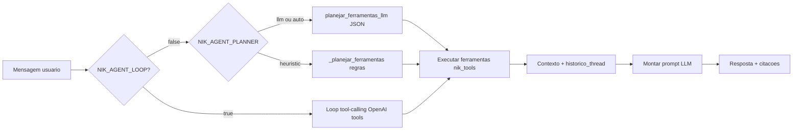
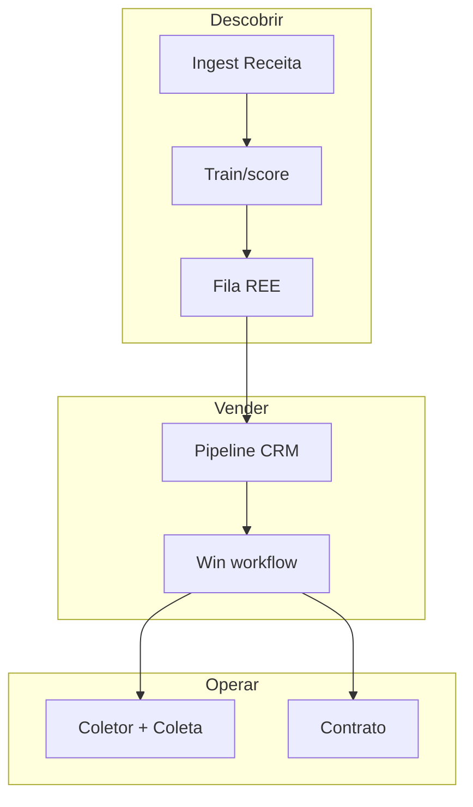

# Diagramas do sistema — Dashboard-TRONIK

Índice consolidado de **todos os diagramas** discutidos e produzidos no desenvolvimento do projeto (arquitetura, prospecção REE, Nik agentic, CRM, fases 0–4). Cada diagrama existe como ficheiro **Mermaid** em [`diagramas/`](diagramas/) para versionamento, diff e renderização no GitHub / VS Code.

**Relacionados:** [ARQUITETURA.md](ARQUITETURA.md) · [PLANO_ML_TRONIK.md](../PLANO_ML_TRONIK.md) · [nik_bot/spec_nik_agent.md](../nik_bot/spec_nik_agent.md) · [jobs/prospeccao/README.md](../jobs/prospeccao/README.md)

**Última consolidação:** maio/2026

---

## Como visualizar

| Onde | Como |
|------|------|
| **GitHub** | Abrir este `.md` ou qualquer `.mmd` — Mermaid renderiza nos ficheiros |
| **VS Code / Cursor** | Extensão “Markdown Preview Mermaid Support” ou preview de `.md` |
| **CLI** | `npx @mermaid-js/mermaid-cli -i docs/diagramas/04-prospeccao-pipeline-v33.mmd -o out.svg` |
| **Legado SVG** | [`diagrama_arquitetura_dashboard.svg`](../diagrama_arquitetura_dashboard.svg) (dashboard antigo) |
| **Legado MMD** | [`arquitetura.mmd`](../arquitetura.mmd) (monólito pré-preview v2) |

---

## Índice por tema

### Sistema e backend

| # | Diagrama | Ficheiro | Origem |
|---|----------|----------|--------|
| 01 | Três camadas (mundo → app → Nik) | [01-sistema-tres-camadas.mmd](diagramas/01-sistema-tres-camadas.mmd) | ARQUITETURA + chat |
| 02 | Blueprints Flask | [02-backend-blueprints.mmd](diagramas/02-backend-blueprints.mmd) | ARQUITETURA |
| 03 | Sequência telemetria IoT | [03-telemetria-sequencia.mmd](diagramas/03-telemetria-sequencia.mmd) | ARQUITETURA |
| 17 | Stack deploy (Gunicorn, PG, Redis, Sentry) | [17-deploy-stack.mmd](diagramas/17-deploy-stack.mmd) | ARQUITETURA + Fase 3 |

### Prospecção REE (ML)

| # | Diagrama | Ficheiro | Origem |
|---|----------|----------|--------|
| 04 | Pipeline v3.3 (ingest → publish → consumo) | [04-prospeccao-pipeline-v33.mmd](diagramas/04-prospeccao-pipeline-v33.mmd) | Chat + `run_pipeline.ps1` |
| 05 | Orquestração por camadas (ingest/ML/API/UI/Nik) | [05-prospeccao-orquestracao-fases.mmd](diagramas/05-prospeccao-orquestracao-fases.mmd) | Rodada subagents |
| 09 | Labels internos (ops → build_features) | [09-labels-internos.mmd](diagramas/09-labels-internos.mmd) | Auditoria Loló |
| 13 | ML coletores + pipeline REE agendado | [13-ml-coletores-legado.mmd](diagramas/13-ml-coletores-legado.mmd) | ARQUITETURA atualizado |

### Produto, CRM e dados

| # | Diagrama | Ficheiro | Origem |
|---|----------|----------|--------|
| 06 | Ciclo operacional Tronik (descobrir → vender → operar) | [06-tronik-ciclo-operacional.mmd](diagramas/06-tronik-ciclo-operacional.mmd) | Auditoria + Fases 1–1b |
| 07 | Ponte CRM ↔ prospecção ↔ ContaComercial | [07-crm-prospeccao-ponte.mmd](diagramas/07-crm-prospeccao-ponte.mmd) | Auditoria + implementação |
| 08 | Preview v2 vs legado (redirects 301) | [08-preview-v2-shell.mmd](diagramas/08-preview-v2-shell.mmd) | Auditoria UX + Fase 1b |
| 14 | ER núcleo (Parceiro, Coletor, Sensor, Coleta) | [14-modelo-dados-nucleo.mmd](diagramas/14-modelo-dados-nucleo.mmd) | ARQUITETURA |
| 15 | ER prospecção + CRM + conta | [15-modelo-dados-prospeccao-crm.mmd](diagramas/15-modelo-dados-prospeccao-crm.mmd) | Modelos maio/2026 |

### Nik (agente IA)

| # | Diagrama | Ficheiro | Origem |
|---|----------|----------|--------|
| 10 | Arquitetura Nik (API → serviços → NIM) | [10-nik-arquitetura.mmd](diagramas/10-nik-arquitetura.mmd) | spec_nik_agent.md |
| 11 | Runtime agentic (loop / planner / memória) | [11-nik-agentic-runtime.mmd](diagramas/11-nik-agentic-runtime.mmd) | Fases 3–4 chat |
| 12 | Catálogo de ferramentas Ops | [12-nik-ferramentas.mmd](diagramas/12-nik-ferramentas.mmd) | nik_tools.py |

### Roadmap e governança

| # | Diagrama | Ficheiro | Origem |
|---|----------|----------|--------|
| 16 | Fases 0 → 4 (confiança operacional) | [16-roadmap-fases.mmd](diagramas/16-roadmap-fases.mmd) | Plano aprovado no chat |

---

## Diagramas embutidos (cópia rápida)

### 04 — Pipeline prospecção v3.3

```mermaid
flowchart LR
  subgraph ingest["Ingestão"]
    R[Receita / Casa dos Dados]
    H[harvest CKAN IBGE PNCP]
    C[CNEFE geocode]
    E[BrasilAPI ANEEL IBRAM IBAMA]
  end
  subgraph core["Core"]
    N[normalize]
    L[link-crm]
    BE[build-enrichment]
    F[build-features v3.3]
    T[train-ranker]
    S[score-candidates]
    P[publish-scores]
  end
  subgraph out["Consumo"]
    API[/api/prospeccao]
    UI[/preview/prospeccao]
    NIK[Nik tools REE]
    CRM[CRM bridge]
  end
  ingest --> N --> L --> BE --> F --> T --> S --> P
  P --> API
  API --> UI
  API --> NIK
  API --> CRM
```

### 11 — Nik agentic runtime



### 06 — Ciclo operacional Tronik



---

## Diagramas históricos (referência)

Estes ficheiros **não foram duplicados** em `diagramas/` porque estão desatualizados ou redundantes; mantêm-se no repo como arquivo.

| Ficheiro | Nota |
|----------|------|
| [`arquitetura.mmd`](../arquitetura.mmd) | Dashboard legado (Lixeira, index.html) |
| [`diagrama_arquitetura_dashboard.svg`](../diagrama_arquitetura_dashboard.svg) | Export SVG do legado |
| [`db_tronik/MODELO_BANCO_DADOS.md`](../db_tronik/MODELO_BANCO_DADOS.md) | ER antigo; preferir 14 e 15 |
| `nik_bot/spec_nik_agent.md` §1 | Diagrama ASCII Nik — substituído por [10-nik-arquitetura.mmd](diagramas/10-nik-arquitetura.mmd) |

### Auditoria (estado na conversa — maio/2026)

Diagramas de **maturidade** usados na revisão profissional (pipeline frágil vs ingest forte) estão **substituídos** pelos diagramas 04, 06 e 07 atualizados. Se precisar do snapshot “pré-correções”, ver histórico do chat ou commit `3fb59a5` anterior.

---

## Manutenção

1. **Novo diagrama:** criar `docs/diagramas/NN-nome.mmd` e acrescentar linha neste índice.
2. **Código mudou:** atualizar o `.mmd` correspondente (não só o chat).
3. **ARQUITETURA.md:** visão estável de alto nível; detalhe e histórico de evolução ficam aqui.
4. **IDs Mermaid:** evitar espaços em IDs de nós; usar `subgraph id["Rótulo com espaços"]`.

---

## Mapa mental (1 página)

```mermaid
flowchart TB
  TRONIK[Dashboard-TRONIK]
  TRONIK --> OPS[Operação IoT]
  TRONIK --> REE[Prospecção REE ML]
  TRONIK --> COM[CRM Comercial Contratos]
  TRONIK --> NIK[Nik agentic]
  TRONIK --> INFRA[CI Health Sentry Redis]
  OPS --> TEL[Telemetria WebSocket]
  REE --> PIPE[jobs/prospeccao]
  REE --> FILA[/preview/prospeccao]
  COM --> PREVIEW[/preview/crm ...]
  NIK --> TOOLS[12+ ferramentas]
  NIK --> LOOP[Agent loop opcional]
```
